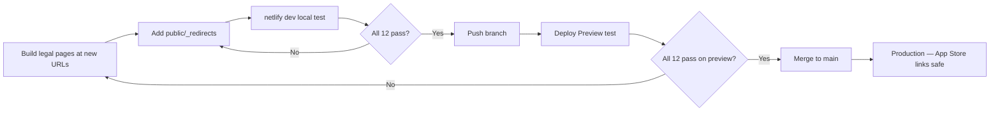
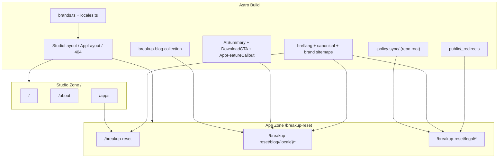

# At Home Labs — Multi-Brand Migration Plan

**Goal:** Refactor `athomelabs.eu` from a flat static HTML site into a **Single Domain, Multi-Brand** architecture where the studio lobby (`/`) and isolated app zones (starting with `/breakup-reset`; more apps later) share one codebase, compound SEO/AEO, and use a Git-based MDX content engine with device-aware app install conversion.

**Status:** Planning  
**Target stack:** Astro + Netlify  
**Repo:** `c:\Users\amtwa\Documents\athomelabspl\homepage`

---

## Executive Summary

The current site is hand-written static HTML with no framework, no build step, and duplicated page shells. It cannot scale to multi-brand layouts, navigation traps, or SEO-grade MDX blogs without migrating to a static site generator.

**Recommendation:** Adopt **Astro** (content collections, layout composition, static MDX output, Netlify-friendly). Do not bolt MDX onto raw HTML.

Existing assets that migrate cleanly: CSS variable patterns, studio copy, Markdown legal sources (`.policy-sync/` — **stays at repo root**; see §4.1), Netlify deployment.

---

## 1. Current State Assessment

### Tech stack today

| Layer | Current | Multi-brand + MDX fit |
|-------|---------|------------------------|
| **Runtime** | None — `npx serve .` | No templating, no MDX compilation |
| **Framework** | None | No layouts, no route composition |
| **Routing** | Filesystem (`/about/index.html`) | No zone awareness |
| **Styling** | Single `styles.css` with `:root` vars | Good foundation, globally scoped only |
| **Content** | Hand-written HTML + client-side `marked` for legal docs | Legal pages not reliably SEO-indexable |
| **Deploy** | Netlify + `_headers` (BIMI) | Compatible with Astro static output |

### What works in our favor

- CSS variables already defined for the studio palette (`styles.css`)
- Cohesive studio visual identity (DM Serif Display + Inter)
- Markdown legal sources exist (`.policy-sync/`, per-locale `PRIVACY_POLICY_APP.md`)
- Netlify hosting is ideal for Astro static builds

### What blocks the vision

1. **Duplicated HTML shells** — header, nav, fonts, footer repeated on every page
2. **Single global nav** — all links point to studio routes; no app-scoped "Home"
3. **Flat legal URL structure** — `/privacy-policy-en/` at root, not under `/breakup-reset/`
4. **Client-side Markdown rendering** — legal pages fetch MD at runtime via CDN `marked` (bad for SEO)
5. **No app zones** — Breakup Reset only appears as a card on `/apps/`
6. **No build pipeline** — MDX, sitemaps, and OG meta require a compile step

### Verdict

**Migrate to Astro.** Keep design tokens and content; replace the delivery mechanism.

---

## 2. Target Architecture

### Zones

| Zone | Base path | Initial scope |
|------|-----------|---------------|
| **Studio** | `/` | ✅ Migrate in Phases 0–2 |
| **Breakup Reset** | `/breakup-reset` | ✅ First app zone — Phases 3–8 |
| **Future apps** | e.g. `/some-app/` | ❌ **Not in initial build** — architectural pattern only |

> **Note on "Job Quest":** Any reference to `/job-quest` in this document is a **placeholder example** for how a second app zone would work. The actual brand name, path, and timing are undecided. Do not scaffold routes, collections, or `brands.ts` entries for it until a real app is ready to ship.

### Navigation traps

When a user enters an app zone:

- Logo / "Home" links to the app root (e.g. `/breakup-reset/`), **not** `/`
- Nav items are app-specific only
- Studio escape hatch (optional): subtle "At Home Labs" link in footer only
- Layout sets `data-brand="breakup-reset"` on `<body>` for scoped CSS

### Scoped CSS pattern

```css
/* Studio */
[data-brand="studio"], :root {
  --bg: #faf8f5;
  --accent: #3C7A89;
  /* ... */
}

/* Breakup Reset — sourced from mobile app theme (see Branding section) */
[data-brand="breakup-reset"] {
  --bg: #EDEAE0;
  --text: #1C2B1A;
  --accent: #2D6A4F;
  --font-display: /* TBD — web font choice */;
}
```

Shared components (`.button`, `.layout`) consume `var(--*)` only — never hard-coded brand colors.

### Target folder structure

```
homepage/
  .policy-sync/             # KEEP AT ROOT — may be populated by CI from mobile repos
  public/
    _redirects              # Netlify 301 rules (see Redirects section)
    _headers                # Migrated from repo root (BIMI MIME rules)
    bimi.svg
    breakup-reset/
      logos/                # Copied from breakup app assets
  scripts/
    sync-legal.mjs          # Optional prebuild: copy .policy-sync/ → build input
  src/
    config/
      brands.ts             # Brands, locales, PostHog IDs, nav
      locales.ts            # Supported locales for hreflang
    layouts/
      BaseLayout.astro      # hreflang, analytics, data-brand
      StudioLayout.astro
      AppLayout.astro
    components/
      SiteHeader.astro
      AppNav.astro
      Hreflang.astro        # <link rel="alternate" hreflang="…"> loop
      Analytics.astro       # Brand-scoped PostHog init
      seo/
        Canonical.astro           # Strip UTM params; strict canonical URL
        JsonLd.astro                # JSON-LD wrapper
        SoftwareApplicationSchema.astro
        FAQPageSchema.astro
      mdx/
        AISummary.astro             # AI/GEO-optimized lead summary (§4.6)
        KeyTakeaways.astro
        DownloadCTA.astro           # Device-aware install CTA (§4.8)
        AppFeatureCallout.astro     # Mid-article conversion interrupt (§4.9)
        FAQ.astro                   # Q&A block + schema hook
    content/
      breakup-blog/         # Isolated collection per app (§4.10, §4.12)
        en/
        es/                 # Future translations
      # jobquest-blog/      # FUTURE — add when a second app ships (§4.12)
    pages/
      404.astro             # Context-aware brand zone (see §4.2)
      index.astro           # Studio /
      about.astro
      apps.astro
      breakup-reset/
        index.astro
        sitemap.xml.ts        # Brand-isolated sitemap (§4.13)
        blog/
          index.astro
          [locale]/
            [...slug].astro   # e.g. /breakup-reset/blog/en/my-post/
            rss.xml.ts        # Per-locale RSS feed
        legal/
          privacy/[locale].astro
          terms/[locale].astro
      # job-quest/          # FUTURE — same shape as breakup-reset when needed
    styles/
      tokens/
        studio.css
        breakup-reset.css
        # {app}.css         # FUTURE — one token file per app zone
      global.css
  docs/
    MIGRATION_PLAN.md       # This file
```

Legal Markdown is **not** moved into `src/content/`. Astro reads from `.policy-sync/` at build time (see §4.1).

---

## 3. Breakup Reset Branding Reference

The web app zone must mirror the mobile app's visual and verbal identity. Source of truth lives in the **breakup** repo:

`c:\Users\amtwa\Documents\athomelabspl\breakup`

### Agent one-liner

> Read design from `breakup/docs/UI_DESIGN_STANDARDS.md`, brand colors from `breakup/assets/config/appConfig.json` and `breakup/src/theme/colors.ts`, quiz-type colors from `breakup/src/types/RecoveryPersonality.ts`, voice from `breakup/docs/tone-of-voice.md`.

### Config

| File | Purpose |
|------|---------|
| `breakup/assets/config/appConfig.json` | App name, theme colors, copy strings, quiz config |
| `breakup/assets/config/legalConfig.json` | Legal page metadata |
| `breakup/app.json` | Expo app manifest |
| `breakup/app.config.js` | Expo build config |

### Theme & design code

| File | Purpose |
|------|---------|
| `breakup/src/theme/colors.ts` | Full light/dark palette, semantic colors, gradients |
| `breakup/src/theme/typography.ts` | Font scale, weights, line heights |
| `breakup/src/theme/spacing.ts` | Spacing scale |
| `breakup/src/theme/shadows.ts` | Shadow tokens |
| `breakup/src/theme/index.ts` | Theme barrel export |
| `breakup/src/context/ThemeContext.tsx` | Runtime theme provider |
| `breakup/src/utils/configLoader.ts` | Loads `appConfig.json` at runtime |
| `breakup/src/utils/colorMix.ts` | Color mixing utilities |
| `breakup/src/types/AppConfig.ts` | Config TypeScript types |
| `breakup/src/types/RecoveryPersonality.ts` | Quiz personality type colors |

### Design docs

| File | Purpose |
|------|---------|
| `breakup/docs/UI_DESIGN_STANDARDS.md` | Component standards, spacing, touch targets |
| `breakup/docs/BAMBOO_TIMELINE_TYPOGRAPHY.md` | Timeline-specific typography |
| `breakup/docs/tone-of-voice.md` | Copy voice: calm, grounding, not clinical |
| `breakup/docs/CONTENT_MARKETING_BRIEF.md` | Marketing content guidelines |
| `breakup/docs/whitelabeling.md` | White-label configuration notes |
| `breakup/docs/screen-design-audit-2026-04-08.md` | Screen design audit |
| `breakup/docs/GROWTH_TIMELINE_IMPLEMENTATION_PLAN.md` | Growth timeline plan |
| `breakup/docs/accessibility-audit.md` | Accessibility standards |
| `breakup/docs/INDEX.md` | Docs index |
| `breakup/ANIMATION_VISUAL_GUIDE.txt` | Animation reference |

### Utilities

| File | Purpose |
|------|---------|
| `breakup/scripts/check-contrast.js` | Contrast ratio checker |

### Related assets (logos / icons)

| Path | Purpose |
|------|---------|
| `breakup/assets/logos/` | Brand logo files |
| `breakup/assets/icon.png` | App icon |
| `breakup/assets/splash.png` | Splash screen |

### Core brand tokens (from `appConfig.json` + `colors.ts`)

Use these as the starting point for `src/styles/tokens/breakup-reset.css`:

| Token | Value | Notes |
|-------|-------|-------|
| `--bg` | `#EDEAE0` | Warm neutral background |
| `--surface` | `#F8F5EC` | Card / elevated surface |
| `--text` | `#1C2B1A` | Primary text (forest black) |
| `--text-secondary` | `#4A5D45` | Muted body text |
| `--accent` / `--primary` | `#2D6A4F` | Forest green — primary brand |
| `--secondary` | `#5C6B3C` | Moss green |
| `--accent-alt` | `#6B7C3E` | Olive accent |
| `--border` | `#D8D3C4` | Subtle borders |

### Recovery personality colors (blog accents / illustrations only)

From `RecoveryPersonality.ts` — use for quiz-related content, not global nav:

| Type | Primary | Vibe |
|------|---------|------|
| Reconnector | `#C67B5C` | Warm clay, earthy |
| Guarded | `#7A8C7A` | Sage grey-green |
| Storm rider | `#8C6E7A` | Dusty mauve-rose |
| Reset builder | `#4A8C6E` | Teal-green, app family |

### Tone of voice (web copy)

From `tone-of-voice.md`:

- Calm, grounding, emotionally literate — not a coach or therapist
- Clarity, emotional safety, brevity
- **Not:** clinical language, productivity framing, self-improvement hype
- Feels like a thoughtful friend, not motivational content

### Web implementation notes

1. Copy `breakup/assets/logos/` into `homepage/public/breakup-reset/logos/`
2. Map `colors.ts` light palette → CSS custom properties in `breakup-reset.css`
3. Choose web fonts that approximate the app's earthy/nature feel (mobile uses system fonts; web can use a serif display + humanist sans — evaluate against `UI_DESIGN_STANDARDS.md`)
4. Run `breakup/scripts/check-contrast.js` logic against web token choices
5. Blog MDX frontmatter should follow `tone-of-voice.md` and `CONTENT_MARKETING_BRIEF.md`

---

## 4. Refactoring Gap Analysis

### Rip out / replace

| Current artifact | Target |
|------------------|--------|
| `index.html`, `about/index.html`, `apps/index.html` | Astro pages + `StudioLayout.astro` |
| `privacy-policy-*/index.html` (×6) | `src/pages/breakup-reset/legal/privacy/[locale].astro` |
| `terms-of-service-*/index.html` (×6) | `src/pages/breakup-reset/legal/terms/[locale].astro` |
| Client-side `marked` scripts | Build-time MD/MDX compilation |
| `npx serve` dev script | `astro dev` / `astro build` |
| Global nav hardcoded in every file | Brand-aware layout components |

### Add (net new)

- `src/config/brands.ts` — brand registry (includes per-zone PostHog config)
- Layout hierarchy: `BaseLayout` → `StudioLayout` / `AppLayout`
- `breakup-blog` content collection (§4.12); add more `{app}-blog` collections when future apps ship; locale-nested folders (§4.10); legal reads from `.policy-sync/` (not moved)
- Context-aware `404.astro` with zone-preserving brand + home link
- `Hreflang.astro` — alternate links for all localized legal pages
- `Canonical.astro`, `SoftwareApplicationSchema.astro`, `FAQPageSchema.astro` (§4.6–§4.7)
- MDX conversion components: `DownloadCTA`, `AppFeatureCallout`, `AISummary` (§4.6–§4.9)
- `public/_redirects` — 301 rules for legacy legal URLs
- `@astrojs/mdx`, `@astrojs/sitemap`, `@astrojs/rss`

---

## 4.1 — `.policy-sync/` Automation (Do Not Move)

**Problem:** `.policy-sync/` may be populated by a GitHub Action or script pulling from mobile app repositories. Moving it into `src/content/` would break that automation.

**Fix:** Leave `.policy-sync/` exactly where it is at the repo root.

**Option A — External content collection (preferred):**

Configure Astro to load legal content from outside `src/`:

```ts
// src/content/config.ts
import { defineCollection } from 'astro:content';

const legal = defineCollection({
  type: 'content',
  // Point loader at repo-root .policy-sync/ via custom glob or loader
});
```

Use a [custom content loader](https://docs.astro.build/en/guides/content-collections/#defining-a-custom-loader) or `glob()` with `base: '../../.policy-sync'` so CI can keep writing to the same path.

**Option B — Prebuild copy script:**

If Astro's loader cannot reference outside `src/` cleanly, add a prebuild step — **do not commit duplicates**:

```json
{
  "scripts": {
    "prebuild": "node scripts/sync-legal.mjs",
    "build": "astro build"
  }
}
```

`scripts/sync-legal.mjs` copies `.policy-sync/*.md` into a gitignored staging dir (e.g. `.astro-legal-cache/`) that the content collection reads. The sync runs on every `npm run build` and Netlify deploy, so CI-updated policies always win.

**Rule:** Never manually edit legal Markdown in two places. `.policy-sync/` remains the single source of truth.

---

## 4.2 — Context-Aware 404 Pages

**Problem:** Astro emits a single `404.html` by default. A user who mistypes `/breakup-reset/blog/en/typo` lands on a studio-branded 404 — breaking brand immersion and sending "Go Home" to `/` instead of `/breakup-reset/`.

**Fix:** Build `src/pages/404.astro` with lightweight client-side zone detection:

```astro
---
// Server: default studio branding
---
<body data-brand="studio">
  <main>
    <h1>Page not found</h1>
    <a id="home-link" href="/">Go home</a>
  </main>
  <script>
    const path = window.location.pathname;
    const zones = [
      { prefix: '/breakup-reset', brand: 'breakup-reset', home: '/breakup-reset/' },
      // Add future app zones here when they ship — same pattern
    ];
    const zone = zones.find((z) => path.startsWith(z.prefix));
    if (zone) {
      document.body.setAttribute('data-brand', zone.brand);
      document.getElementById('home-link').href = zone.home;
    }
  </script>
</body>
```

Import all brand token CSS files on the 404 page so `data-brand` switches take effect immediately. Keep the script minimal — pathname prefix matching only, no framework.

**Phase:** Add during **Phase 1** (brand system), before app zone pages ship.

---

## 4.3 — SEO: hreflang for Localized Pages (Legal + Blog)

**Problem:** Generating localized URLs is not enough. Without explicit cross-linking, Google may treat locales as duplicate content — for legal pages **and** translated blog posts.

**Fix:** `BaseLayout` (or `Hreflang.astro`) must inject alternate-language links for every localized page:

```html
<link rel="alternate" hreflang="en" href="https://athomelabs.eu/breakup-reset/legal/privacy/en/" />
<link rel="alternate" hreflang="es" href="https://athomelabs.eu/breakup-reset/legal/privacy/es/" />
<!-- … all supported locales … -->
<link rel="alternate" hreflang="x-default" href="https://athomelabs.eu/breakup-reset/legal/privacy/en/" />
```

**Implementation:**

1. Define supported locales in `src/config/locales.ts` (e.g. `en`, `es`, `fr`, `de`, `pt`, `pl`)
2. Legal page templates receive `docType` (`privacy` | `terms`), `brand`, and `locale` as props
3. Blog posts link translations via shared `translationKey` frontmatter (§4.10) — `Hreflang.astro` queries siblings with the same key
4. Loop locales in the layout and emit one `<link rel="alternate">` per sibling URL
5. Set `x-default` to English (or your primary App Store locale)
6. Add `canonical` pointing to the current locale's URL

**Phase:** Required in **Phase 4** (legal migration) and **Phase 8** (blog) — not optional SEO polish.

---

## 4.4 — Analytics and Consent Isolation

**Problem:** A single PostHog snippet in `BaseLayout` would mix studio traffic with sensitive breakup-recovery app traffic in one project.

**Fix:** Extend `brands.ts` with per-zone analytics config. `BaseLayout` initializes tracking only for the active brand:

```ts
export const brands = {
  studio: {
    id: 'studio',
    basePath: '/',
    name: 'At Home Labs',
    analytics: {
      posthogProjectKey: import.meta.env.PUBLIC_POSTHOG_STUDIO_KEY,
      posthogHost: 'https://eu.i.posthog.com',
    },
  },
  'breakup-reset': {
    id: 'breakup-reset',
    basePath: '/breakup-reset',
    name: 'Breakup Reset',
    analytics: {
      posthogProjectKey: import.meta.env.PUBLIC_POSTHOG_BREAKUP_KEY,
      posthogHost: 'https://eu.i.posthog.com',
    },
  },
  // Add future apps here when ready — copy breakup-reset shape, new path + tokens
} as const;
```

**Rules:**

- Separate PostHog project keys (or at minimum distinct `distinct_id` namespace + project tags) per zone
- Studio pages never send events to the Breakup Reset project
- App zone pages require consent before initializing (especially EU users) — wire a minimal cookie/consent banner scoped per zone if needed
- Store keys in Netlify environment variables, never in the repo
- Legal pages: consider **no analytics** or analytics-disabled by default given sensitivity

**Phase:** Add during **Phase 1** (brand system); consent banner before **Phase 7** merge if tracking app zones in production.

---

## 4.5 — Per-Brand RSS Feeds (`@astrojs/rss`)

**Problem:** A Git-based MDX blog without RSS misses distribution and backlink channels.

**Fix:** Add `@astrojs/rss` in **Phase 0** scaffold. Generate **per-brand, per-locale** feeds (§4.10) so English subscribers are not spammed when Spanish posts ship:

| Feed URL | Content |
|----------|---------|
| `/breakup-reset/blog/en/rss.xml` | Breakup Reset posts in English only |
| `/breakup-reset/blog/es/rss.xml` | Breakup Reset posts in Spanish only |
| `/{future-app}/blog/en/rss.xml` | Same pattern per app when added |

```ts
// src/pages/breakup-reset/blog/[locale]/rss.xml.ts
import rss from '@astrojs/rss';
import { getCollection } from 'astro:content';

export async function GET(context) {
  const { locale } = context.params;
  const posts = await getCollection('breakup-blog', ({ data }) => data.locale === locale);
  return rss({
    title: `Breakup Reset Blog (${locale})`,
    site: context.site,
    items: posts.map((post) => ({ ... })),
  });
}
```

Link feeds from each locale's blog index (`<link rel="alternate" type="application/rss+xml" …>`). Do **not** publish a studio-wide RSS that mixes app niches or locales.

**Phase:** Scaffold in **Phase 0**; implement feeds in **Phase 8** when blog collection ships.

---

## 4.6 — AEO & GEO (Optimizing for AI Engines)

Traditional SEO optimizes for links and keywords. **Generative Engine Optimization (GEO)** optimizes for parsing, entity recognition, and direct answers. LLMs (ChatGPT, Perplexity, Google AI Overviews) prefer dense, factual, well-structured text.

### The `<AISummary>` / `<KeyTakeaways>` MDX component

LLMs aggressively scrape the **first ~200 words** of an article to generate summaries. Every blog post must open with a dedicated summary block:

```mdx
---
# File: src/content/breakup-blog/en/stop-checking-social-media.mdx
title: "How to stop checking your ex's social media"
locale: en
translationKey: stop-checking-social-media
---

<AISummary>
- Checking an ex's profile every hour is a **dopamine withdrawal loop**, not a sign you still love them.
- Research suggests social-media monitoring **extends recovery by weeks** (Journal of Social and Personal Relationships, 2020).
- The most effective interrupt is a **timed distraction task** lasting 10–15 minutes.
</AISummary>

You might find yourself opening Instagram without thinking...
```

**Rules for AI-summary blocks:**

- Place at the **top** of every post, before the narrative hook
- Use bullet points and **exact-match facts** (statistics, named frameworks, study citations)
- Keep under 200 words; favor declarative sentences over marketing copy
- If an AI engine uses your summary verbatim, it is highly likely to **cite you as the source**

Register `AISummary` and `KeyTakeaways` as global MDX components in `astro.config.mjs`.

### Density & citations

AI engines look for authority signals. Embed early in each post:

- Statistics with source attribution
- Named psychological frameworks (e.g. **Attachment Theory**, grief stages, dopamine withdrawal)
- Direct definitions of key terms in the first three paragraphs

### FAQ schema (JSON-LD)

AI engines actively hunt for Q&A formats. Use `FAQPage` schema on:

- App landing pages (e.g. `/breakup-reset/`; repeat per future app)
- Bottom-of-blog FAQ sections

**Content pattern:** Frame headers as literal user questions, answer in one sentence first, then elaborate:

```mdx
<FAQ items={[
  {
    question: "How long does it take to get over a breakup?",
    answer: "Most people report meaningful emotional stability within 3–6 months, though timelines vary widely.",
    elaboration: "Recovery depends on relationship length, attachment style, and daily habits like social-media monitoring..."
  }
]} />
```

`FAQ.astro` renders visible HTML **and** emits matching `FAQPage` JSON-LD via `FAQPageSchema.astro`.

**Phase:** MDX components in **Phase 8**; `FAQPage` schema on app landings in **Phase 3**.

---

## 4.7 — Advanced Technical SEO

Astro gives full `<head>` control. Extend `BaseLayout` beyond hreflang (§4.3).

### SoftwareApplication schema

On each app zone landing page (starting with `/breakup-reset/`), inject `SoftwareApplication` JSON-LD:

```json
{
  "@context": "https://schema.org",
  "@type": "SoftwareApplication",
  "name": "Breakup Reset",
  "operatingSystem": "iOS, Android",
  "applicationCategory": "HealthApplication",
  "offers": { "@type": "Offer", "price": "0", "priceCurrency": "USD" },
  "aggregateRating": { "@type": "AggregateRating", "ratingValue": "4.8", "ratingCount": "120" }
}
```

Pull `name`, store URLs, and app IDs from `brands.ts`. This enables Google rich "App" snippets in search results.

### Strict canonicalization

Marketing URLs accumulate query params (`?utm_source=tiktok`, `?source=qr`). Without canonical tags, Google may index duplicate versions of the same page.

`Canonical.astro` in `BaseLayout` must:

1. Read `Astro.url.pathname` (ignore query string)
2. Emit `<link rel="canonical" href="https://athomelabs.eu{pathname}" />`
3. Always emit trailing slashes — must match `trailingSlash: 'always'` (§4.11)

Apply on **every** page: blog posts, app landings, legal pages.

**Phase:** `Canonical.astro` + `SoftwareApplicationSchema.astro` in **Phase 1** (BaseLayout); populate ratings/IDs in **Phase 3**.

---

## 4.8 — App Conversion Engine (Banners & QR)

Drive mobile installs with **device-aware UI**. Showing a QR code to an iPhone user in Safari is a dead end.

### `<DownloadCTA app="breakup-reset" />` MDX component

Drop directly into Markdown files. Uses CSS media queries and lightweight client JS to swap UI by device:

| Device | UI display | Action |
|--------|------------|--------|
| **Desktop** | App Store badge + **dynamic QR code** | User scans with phone to install |
| **iOS / Safari** | Apple App Store button | Deep link to App Store |
| **Android / Chrome** | Google Play button | Deep link to Play Store |

```mdx
<DownloadCTA app="breakup-reset" source="blog-social-media-post" />
```

Store URLs, app IDs, and deep-link schemes live in `brands.ts`:

```ts
'breakup-reset': {
  // ...
  stores: {
    ios: { appId: 'YOUR_APP_ID', url: 'https://apps.apple.com/...' },
    android: { packageId: 'com.athomelabs.breakupreset', url: 'https://play.google.com/...' },
    deepLinkScheme: 'breakupreset://',
  },
},
```

### Smart App Banner (iOS)

Apple provides a native Safari banner. Add to `AppLayout.astro` / `BaseLayout.astro` when in an app zone:

```html
<meta name="apple-itunes-app" content="app-id=YOUR_APP_ID, app-argument=breakupreset://" />
```

Pull `appId` and `deepLinkScheme` from `brands.ts` per active brand. Android has no native equivalent — rely on `<DownloadCTA>` for Android users.

### Parameterized QR codes (not static)

**Do not** use generic QR codes pointing to the app homepage.

Generate QR codes from **post-specific tracking URLs**:

```
https://athomelabs.eu/breakup-reset/blog/en/stop-the-scroll?source=qr
```

`DownloadCTA` builds the QR from `Astro.url.pathname + ?source=qr` (or a PostHog/AppsFlyer redirect URL configured per post). This tracks which blog post drives the highest desktop-to-mobile conversion.

**Phase:** `DownloadCTA.astro` + Smart App Banner meta in **Phase 8**; store IDs in `brands.ts` during **Phase 3**.

---

## 4.9 — Content Interruption Strategy

Do not wait until the bottom of a 2,000-word post to ask for the install. Interrupt the reader **at the moment they feel the problem** you are describing.

### `<AppFeatureCallout>` MDX component

```mdx
You might find yourself checking their social media every hour. This is a standard dopamine withdrawal loop.

<AppFeatureCallout
  app="breakup-reset"
  title="Stop the scroll"
  description="Breakup Reset has an emergency Distraction Mode to break this exact loop."
/>

The best way to break this loop is to replace the habit with a timed activity...
```

**Rules:**

- One callout per major problem section (max 2–3 per post)
- `title` names the pain; `description` maps to a **specific app feature**
- Renders inline with brand tokens from `data-brand`
- Optional `feature` prop for PostHog event tagging (`feature=distraction-mode`)

Keep Markdown clean; all conversion logic lives in reusable Astro components registered for MDX.

**Phase:** Build alongside `<DownloadCTA>` in **Phase 8**.

---

## 4.10 — Blog i18n Structure (Locale-Nested from Day One)

**Problem:** The plan handles i18n well for legal pages (`[locale].astro` + `Hreflang.astro`), but a flat blog structure (`/breakup-reset/blog/my-post/`) forces a messy URL refactor when Spanish articles are added later.

**Fix:** Nest blog content and routing by locale during **Phase 8** — adds ~10 minutes upfront, saves days of routing work later.

### 1. Add `locale` to each brand's collection schema

See §4.12 for **separate collections per app** (initially `breakup-blog` only). Each schema includes:

```ts
locale: z.enum(['en', 'es', 'fr', 'de', 'pt', 'pl']).default('en'),
translationKey: z.string(), // hreflang sibling lookup (§4.3)
```

`locale` must match the folder the file lives in. Validate in a collection hook or lint script if needed.

### 2. Nest MDX files by locale (per collection)

```plaintext
src/content/breakup-blog/
  ├── en/
  │   └── stop-checking-social-media.mdx
  └── es/
      └── como-dejar-de-mirar-redes.mdx    # future — drop in, no code changes

# Future: src/content/{app}-blog/en/ when a second app ships
```

English-only launch uses only the `en/` folder under `breakup-blog/`.

### 3. Locale-aware blog routing

Rename the dynamic route from `[...slug].astro` to `[locale]/[...slug].astro`:

```plaintext
src/pages/breakup-reset/blog/[locale]/[...slug].astro
# Future: src/pages/{app}/blog/[locale]/[...slug].astro — copy this pattern
```

`getStaticPaths()` reads from the **brand-specific** collection only — no `brand` frontmatter filter:

```ts
export async function getStaticPaths() {
  const posts = await getCollection('breakup-blog');
  return posts.map((post) => ({
    params: { locale: post.data.locale, slug: post.slug },
    props: { post },
  }));
}
```

### Permanent URL shape

| Content | URL |
|---------|-----|
| English post | `athomelabs.eu/breakup-reset/blog/en/stop-checking-social-media/` |
| Spanish post (future) | `athomelabs.eu/breakup-reset/blog/es/como-dejar-de-mirar-redes/` |

English URLs are **stable from day one** — no refactor when translations ship.

### Why this pays off

| Concern | How locale nesting helps |
|---------|--------------------------|
| **Scaling translations** | Drop `es/*.mdx` into the folder; router auto-generates `/es/...` URLs |
| **hreflang** | `Hreflang.astro` queries posts with the same `translationKey`; cross-links en ↔ es with zero new routing code |
| **RSS** | Per-locale feeds at `/breakup-reset/blog/en/rss.xml` — no mixed-language subscriber spam |
| **Sitemap** | Brand-isolated sitemaps per §4.13 — not one mixed root sitemap |

**Phase:** All adjustments are **Phase 8** requirements — do not ship a flat blog structure even for English-only launch.

---

## 4.11 — Trailing Slash / Redirect Loop Trap (Critical)

**Problem:** Astro and Netlify handle trailing slashes differently by default. If they disagree, you get infinite redirect loops (browser crash) or silent duplicate-content bugs.

| System | Default behavior |
|--------|------------------|
| **Astro** | Drops trailing slash (`/about`) |
| **Netlify CDN** | Enforces pretty URLs with trailing slash (`/about/`) via internal 301 |

**Risk:** User clicks internal link → Astro emits `/about` → Netlify 301s to `/about/` → mismatch with Astro's canonical → loop or double-redirect on App Store legal URLs.

**Fix:** Force alignment in **Phase 0** — before any page ships:

```js
// astro.config.mjs
export default defineConfig({
  site: 'https://athomelabs.eu',
  trailingSlash: 'always', // Match Netlify CDN behavior
  build: {
    format: 'directory',   // Compiles about.astro → /about/index.html
  },
  // ...
});
```

**Redirect rule correction:** Every target in `public/_redirects` **must** end with `/`:

```plaintext
# CORRECT — single 301, no double-redirect
/privacy-policy-en/    /breakup-reset/legal/privacy/en/    301

# WRONG — Netlify appends slash, causing double-redirect chain
/privacy-policy-en/    /breakup-reset/legal/privacy/en     301
```

Audit all internal links, `Canonical.astro`, sitemap URLs, and RSS item links to use trailing slashes consistently.

**Phase:** **Phase 0** (astro config) + **Phase 5** (verify `_redirects` targets).

---

## 4.12 — Content Collection Isolation (Build Safety)

**Problem:** A single `blog` collection filtered by a `brand` enum in frontmatter is fragile. Astro compiles all MDX in a collection together — a missing or mistyped `brand` tag leaks posts into the wrong app's blog index. You also cannot enforce **different schemas** per app.

**Fix:** Use **one content collection per app** — physical isolation, not runtime filtering. **Initial scope:** `breakup-blog` only. Add `{app}-blog` when a second app is ready to ship:

```ts
// src/content/config.ts
import { defineCollection, z } from 'astro:content';

const breakupBlog = defineCollection({
  type: 'content',
  schema: z.object({
    title: z.string(),
    description: z.string(),
    pubDate: z.coerce.date(),
    locale: z.enum(['en', 'es', 'fr', 'de', 'pt', 'pl']).default('en'),
    translationKey: z.string(),
    trackingSlug: z.string().optional(),
    faq: z.array(z.object({
      question: z.string(),
      answer: z.string(),
      elaboration: z.string().optional(),
    })).optional(), // Breakup-specific — encouraged for AEO
  }),
});

// When a second app ships, add e.g.:
// const someAppBlog = defineCollection({ type: 'content', schema: z.object({ ... }) });

export const collections = {
  'breakup-blog': breakupBlog,
  // '{app}-blog': someAppBlog,  // add per future app
};
```

| Collection | Folder | Routes | `getCollection()` |
|------------|--------|--------|-------------------|
| `breakup-blog` | `src/content/breakup-blog/{locale}/` | `/breakup-reset/blog/...` | `getCollection('breakup-blog')` |
| `{app}-blog` | `src/content/{app}-blog/{locale}/` | `/{app}/blog/...` | *Future — same pattern* |

This hard-isolates code, schemas, and routing between brands. A mistyped frontmatter field fails the build instead of silently publishing in the wrong zone.

**Phase:** **Phase 8** — define `breakup-blog` before the first MDX post. Additional collections only when a real second app launches.

---

## 4.13 — Brand-Isolated Sitemaps (Topical Authority)

**Problem:** `@astrojs/sitemap` dumps every compiled HTML file into one root `sitemap-index.xml` by default. Google sees breakup coping articles mixed with job-hunting tips in a single index — diluting topical authority for AI engines and search bots.

**Fix:** Filter the root sitemap to **studio pages only**, then generate per-brand sub-sitemaps in **Phase 8**:

```js
// astro.config.mjs
import sitemap from '@astrojs/sitemap';

export default defineConfig({
  integrations: [
    sitemap({
      // Root sitemap: studio zone only
      filter: (page) => !page.includes('/breakup-reset'),
      // Add !page.includes('/{future-app}') as new zones ship
    }),
  ],
});
```

Generate brand-specific sitemaps that pull only from their collection + legal routes:

```ts
// src/pages/breakup-reset/sitemap.xml.ts
import { getCollection } from 'astro:content';

export async function GET() {
  const posts = await getCollection('breakup-blog');
  const urls = [
    'https://athomelabs.eu/breakup-reset/',
    // ... legal URLs per locale ...
    ...posts.map((p) => `https://athomelabs.eu/breakup-reset/blog/${p.data.locale}/${p.slug}/`),
  ];
  // Emit sitemap XML
}
```

Add one sitemap per app zone in `robots.txt` as apps ship:

```plaintext
Sitemap: https://athomelabs.eu/sitemap-index.xml
Sitemap: https://athomelabs.eu/breakup-reset/sitemap.xml
# Sitemap: https://athomelabs.eu/{future-app}/sitemap.xml
```

**Phase:** Root filter in **Phase 0** scaffold; brand sub-sitemaps in **Phase 8**.

---

## 4.14 — `_headers` Path Sync (Security & Caching)

**Problem:** Moving `_headers` to `public/` preserves BIMI config, but rules mapped to **old URL paths** become dead code after migration.

**Current `_headers` (repo root):** Only `/bimi.svg` rules — no breakage today.

**Risk:** If you add path-specific rules later (cache, `X-Frame-Options`, CSP for legal pages) using old patterns like `/privacy-policy-en/*`, those headers will not apply to `/breakup-reset/legal/privacy/en/`.

**Fix:** Audit `public/_headers` in **Phase 5** before deploy:

```plaintext
# BIMI — unchanged
/bimi.svg
  Content-Type: image/svg+xml; charset=utf-8
  Cache-Control: public, max-age=300
  X-Content-Type-Options: nosniff

# Legal pages — NEW paths (if adding security/cache rules)
/breakup-reset/legal/*
  X-Frame-Options: DENY
  X-Content-Type-Options: nosniff

# Blog — optional cache for static assets only, not HTML
/breakup-reset/logos/*
  Cache-Control: public, max-age=86400
```

**Checklist before merge:**

- [ ] No rules reference `/privacy-policy-*` or `/terms-of-service-*` paths
- [ ] New legal path globs use `/breakup-reset/legal/*`
- [ ] BIMI path still resolves after `bimi.svg` moves to `public/`

**Phase:** **Phase 5** (alongside `_redirects` migration).

---

## 5. Phase Plan

| Phase | Scope | Gate |
|-------|-------|------|
| **0 — Scaffold** | Astro + Netlify adapter; `trailingSlash: 'always'` + `build.format: 'directory'` (§4.11); `@astrojs/mdx`, `@astrojs/sitemap` (studio-only filter), `@astrojs/rss` | — |
| **1 — Brand system** | `brands.ts` (incl. PostHog IDs), layouts, CSS tokens, context-aware `404.astro`, `Analytics.astro` | — |
| **2 — Studio pages** | Migrate `/`, `/about`, `/apps` | — |
| **3 — App zone** | `/breakup-reset/` landing; `SoftwareApplication` JSON-LD; `FAQPage` schema; store IDs in `brands.ts`; iOS Smart App Banner meta | — |
| **4 — Legal migration** | 6 locales × 2 doc types from `.policy-sync/` (not moved); hreflang in `BaseLayout` | **Must exist before redirects work** |
| **5 — Redirects** | `public/_redirects` (all targets end with `/`) + `public/_headers` path audit (§4.14) | — |
| **6 — Local QA** | `netlify dev` redirect testing | **Must pass before PR** |
| **7 — Deploy Preview** | Verify all 12 redirects on Netlify preview URL; consent banner if app analytics live | **Must pass before merge to main** |
| **8 — Blog + growth** | `breakup-blog` collection (§4.12), locale routing (§4.10), per-locale RSS, Breakup Reset sitemap (§4.13), AEO + conversion MDX | After legal cutover verified |

---

## 6. Netlify Redirects & Staging (App Store Safety)

App Store and Play Store links point at the current flat legal URLs. A failed redirect risks store rejection. This process is a **merge blocker**.

### Step 1 — Create `public/_redirects`

In Astro, root-level Netlify files must live in `public/` (copied verbatim to `dist/` at build).

```
public/
  ├── _redirects      # No file extension
  ├── _headers        # Migrated from repo root
  ├── bimi.svg
  └── breakup-reset/
      └── logos/
```

### Step 2 — Write 301 redirect rules

Netlify processes rules top to bottom. Syntax: `/old-path /new-path 301`

```plaintext
# Breakup Reset - Privacy Policies
/privacy-policy-en/    /breakup-reset/legal/privacy/en/    301
/privacy-policy-es/    /breakup-reset/legal/privacy/es/    301
/privacy-policy-fr/    /breakup-reset/legal/privacy/fr/    301
/privacy-policy-de/    /breakup-reset/legal/privacy/de/    301
/privacy-policy-pt/    /breakup-reset/legal/privacy/pt/    301
/privacy-policy-pl/    /breakup-reset/legal/privacy/pl/    301

# Breakup Reset - Terms of Service
/terms-of-service-en/  /breakup-reset/legal/terms/en/      301
/terms-of-service-es/  /breakup-reset/legal/terms/es/      301
/terms-of-service-fr/  /breakup-reset/legal/terms/fr/      301
/terms-of-service-de/  /breakup-reset/legal/terms/de/      301
/terms-of-service-pt/  /breakup-reset/legal/terms/pt/      301
/terms-of-service-pl/  /breakup-reset/legal/terms/pl/      301
```

- Use **301** (permanent) so SEO authority and Apple crawlers treat this as canonical
- **Every source and target path must end with `/`** — see §4.11; missing trailing slash on targets causes double-redirects on App Store links
- Trailing slashes must match `trailingSlash: 'always'` in `astro.config.mjs`

### Step 3 — Test locally with Netlify CLI

**Do not use `astro dev` to test redirects** — Astro's dev server does not parse `_redirects`.

```bash
npm install -g netlify-cli
npm run build
netlify dev
```

Open `http://localhost:8888/privacy-policy-en/` — should redirect to `/breakup-reset/legal/privacy/en/`.

**Local verification checklist (all 12 URLs):**

| Legacy URL | Expected destination |
|------------|---------------------|
| `/privacy-policy-en/` | `/breakup-reset/legal/privacy/en/` |
| `/privacy-policy-es/` | `/breakup-reset/legal/privacy/es/` |
| `/privacy-policy-fr/` | `/breakup-reset/legal/privacy/fr/` |
| `/privacy-policy-de/` | `/breakup-reset/legal/privacy/de/` |
| `/privacy-policy-pt/` | `/breakup-reset/legal/privacy/pt/` |
| `/privacy-policy-pl/` | `/breakup-reset/legal/privacy/pl/` |
| `/terms-of-service-en/` | `/breakup-reset/legal/terms/en/` |
| `/terms-of-service-es/` | `/breakup-reset/legal/terms/es/` |
| `/terms-of-service-fr/` | `/breakup-reset/legal/terms/fr/` |
| `/terms-of-service-de/` | `/breakup-reset/legal/terms/de/` |
| `/terms-of-service-pt/` | `/breakup-reset/legal/terms/pt/` |
| `/terms-of-service-pl/` | `/breakup-reset/legal/terms/pl/` |

Each final destination must return **200** with full legal content rendered at build time.

### Step 4 — Deploy Preview verification (merge blocker)

1. `git checkout -b astro-migration`
2. Push to GitHub — Netlify generates a Deploy Preview (e.g. `https://deploy-preview-12--athomelabs.netlify.app`)
3. Append each legacy path to the preview URL and confirm redirect + content
4. Check Network tab for **301** status on the legacy URL
5. Confirm app zone layout (no studio nav on legal pages)

**Do not merge to `main` until all 12 pass on Deploy Preview.**

### Staging flow



### Netlify build settings

| Setting | Value |
|---------|-------|
| Build command | `npm run build` (runs `prebuild` → `sync-legal.mjs` if using Option B in §4.1) |
| Publish directory | `dist` |
| Environment variables | `PUBLIC_POSTHOG_STUDIO_KEY`, `PUBLIC_POSTHOG_BREAKUP_KEY` (+ per future app) |

---

## 7. Step-by-Step Implementation

### Foundation

1. Initialize Astro in-repo:
   ```bash
   npm create astro@latest . -- --template minimal --install --typescript strict
   npm install @astrojs/mdx @astrojs/sitemap @astrojs/rss
   ```
2. Add `astro.config.mjs` with MDX integration, `site: 'https://athomelabs.eu'`, and Netlify-aligned output (§4.11):
   ```js
   export default defineConfig({
     site: 'https://athomelabs.eu',
     trailingSlash: 'always',
     build: { format: 'directory' },
     integrations: [
       mdx({ /* component registry */ }),
       sitemap({
         filter: (page) => !page.includes('/breakup-reset'),
         // Add !page.includes('/{future-app}') as new zones ship
       }),
     ],
   });
   ```
3. Create `src/config/brands.ts` — brand registry with per-zone PostHog keys (env vars)
4. Create `src/config/locales.ts` — locale list for hreflang generation
5. Build layout hierarchy: `BaseLayout` → `StudioLayout` / `AppLayout`
   - `BaseLayout` injects `Hreflang.astro`, `Analytics.astro`, `Canonical.astro` (§4.7), `data-brand`
6. Create `src/pages/404.astro` — context-aware zone branding (§4.2)
7. Port `styles.css` → `src/styles/tokens/studio.css` + `src/styles/global.css`

### Brand registry shape (`src/config/brands.ts`)

```ts
export const brands = {
  studio: {
    id: 'studio',
    basePath: '/',
    name: 'At Home Labs',
    tokens: 'studio',
    analytics: {
      posthogProjectKey: import.meta.env.PUBLIC_POSTHOG_STUDIO_KEY,
      posthogHost: 'https://eu.i.posthog.com',
    },
  },
  'breakup-reset': {
    id: 'breakup-reset',
    basePath: '/breakup-reset',
    name: 'Breakup Reset',
    tokens: 'breakup-reset',
    // colors sourced from breakup/assets/config/appConfig.json
    analytics: {
      posthogProjectKey: import.meta.env.PUBLIC_POSTHOG_BREAKUP_KEY,
      posthogHost: 'https://eu.i.posthog.com',
    },
    stores: {
      ios: { appId: 'YOUR_APP_ID', url: 'https://apps.apple.com/...' },
      android: { packageId: 'com.athomelabs.breakupreset', url: 'https://play.google.com/...' },
      deepLinkScheme: 'breakupreset://',
    },
  },
  // Future apps: copy breakup-reset entry with new id, basePath, tokens, stores
} as const;
```

Register MDX components globally in `astro.config.mjs`:

```js
import { defineConfig } from 'astro/config';
import mdx from '@astrojs/mdx';

export default defineConfig({
  integrations: [
    mdx({
      components: {
        AISummary: './src/components/mdx/AISummary.astro',
        KeyTakeaways: './src/components/mdx/KeyTakeaways.astro',
        DownloadCTA: './src/components/mdx/DownloadCTA.astro',
        AppFeatureCallout: './src/components/mdx/AppFeatureCallout.astro',
        FAQ: './src/components/mdx/FAQ.astro',
      },
    }),
  ],
});
```

### Studio migration

8. Migrate `index.html` → `src/pages/index.astro`
9. Migrate `about/index.html` → `src/pages/about.astro`
10. Migrate `apps/index.html` → `src/pages/apps.astro` (link to `/breakup-reset/`)

### App zone + legal

11. Create `src/pages/breakup-reset/index.astro` with `AppLayout` + Breakup Reset tokens
    - Inject `SoftwareApplicationSchema.astro` + `FAQPageSchema.astro` (§4.6, §4.7)
    - Add iOS Smart App Banner meta from `brands.ts` store config (§4.8)
12. Copy logos from `breakup/assets/logos/` → `public/breakup-reset/logos/`
13. Wire legal content collection to read from `.policy-sync/` at repo root (§4.1) — **do not move the folder**
14. Generate static pages at `/breakup-reset/legal/privacy/[locale]/` and `/breakup-reset/legal/terms/[locale]/`
15. Add `Hreflang.astro` to legal templates — loop all locales, emit `rel="alternate"` + `hreflang="x-default"` (§4.3)

### Redirect safety net

16. Create `public/_redirects` with all 12 rules — verify every target ends with `/` (§4.11)
17. Move `_headers` and `bimi.svg` into `public/`; audit path globs for new legal URLs (§4.14)
18. Set Netlify env vars for per-zone PostHog keys
19. Local test: `npm run build && netlify dev`
20. Push branch → Deploy Preview → verify all 12 → merge

### Content engine (post-cutover)

21. Define `breakup-blog` content collection (§4.12) — no second-app collection until one exists
22. Create `src/content/breakup-blog/{locale}/`
23. Create `src/pages/breakup-reset/blog/[locale]/[...slug].astro` using `getCollection('breakup-blog')` only (§4.10)
24. Build MDX conversion + AEO components: `AISummary`, `FAQ`, `DownloadCTA`, `AppFeatureCallout` (§4.6–§4.9)
25. Create per-locale RSS endpoints: `breakup-reset/blog/[locale]/rss.xml.ts` (§4.5, §4.10)
26. Wire `Hreflang.astro` on blog posts — sibling lookup via `translationKey` (§4.3)
27. Publish first MDX post per app zone in `en/` — must include `<AISummary>` and at least one `<AppFeatureCallout>`
28. Generate `breakup-reset/sitemap.xml.ts` (§4.13) — add more per app when they ship
29. Configure OG tags; verify `Canonical.astro` strips UTM params and uses trailing slashes
30. Remove legacy `privacy-policy-*/` and `terms-of-service-*/` folders from repo (`.policy-sync/` stays)

### Content collection schemas (isolated per brand — §4.12)

See full definitions in §4.12. Summary:

| Collection | Folder | Required fields |
|------------|--------|-----------------|
| `breakup-blog` | `src/content/breakup-blog/{locale}/` | `title`, `description`, `pubDate`, `locale`, `translationKey`; `faq` encouraged |
| `{app}-blog` | *Future* | Same base fields; schema tailored per app when added |

Posts live at `src/content/breakup-blog/en/my-post.mdx` → `/breakup-reset/blog/en/my-post/`.

No `brand` frontmatter field — the collection name **is** the brand boundary.

### Example blog post structure (AEO + conversion)

```mdx
---
title: "How to stop checking your ex's social media"
description: "A practical guide to breaking the dopamine withdrawal loop after a breakup."
pubDate: 2026-06-10
locale: en
translationKey: stop-checking-social-media
faq:
  - question: "Is checking my ex's Instagram normal after a breakup?"
    answer: "Yes — it is a common dopamine withdrawal response, not a sign you should reunite."
---

<AISummary>
- Hourly social-media checks are a **dopamine withdrawal loop**, not proof of lingering love.
- Studies link post-breakup monitoring to **longer recovery timelines**.
- A 10–15 minute distraction task is the most effective immediate interrupt.
</AISummary>

You might find yourself checking their social media every hour...

<AppFeatureCallout
  app="breakup-reset"
  title="Stop the scroll"
  description="Breakup Reset has an emergency Distraction Mode to break this exact loop."
  feature="distraction-mode"
/>

## How long does it take to get over a breakup?

Most people report meaningful stability within 3–6 months...

<FAQ />

<DownloadCTA app="breakup-reset" source="blog-social-media-post" />
```

---

## 8. Implementation Effort

| Phase | Hours |
|-------|-------|
| Astro scaffold + studio page migration | 6–10h |
| Brand system + layouts + CSS tokens + 404 + analytics | 10–14h |
| Breakup Reset app zone + branding port | 8–12h |
| Legal page migration (6 locales × 2 docs) + hreflang | 14–22h |
| `.policy-sync/` loader / prebuild script | 2–4h |
| `public/_redirects` + `_headers` + Netlify config | 2–3h |
| Local + Deploy Preview redirect QA | 2–4h |
| MDX blog + `breakup-blog` collection + Breakup Reset sitemap | 16–24h |
| AEO/GEO components + JSON-LD schemas + conversion UI | 10–16h |
| Trailing slash + sitemap isolation + headers audit | 2–4h |
| **Total** | **70–110h (9–14 working days)** |

**MVP slice** (studio + one app + redirects, legal deferred): ~24–32h (3–4 days) — not recommended if App Store links must stay safe.

---

## 9. Architecture Diagram



---

## 10. Key Risks

| Risk | Mitigation |
|------|------------|
| App Store URL breakage | `public/_redirects` + Deploy Preview QA before merge |
| `.policy-sync/` CI breakage | Keep folder at repo root; external loader or prebuild copy (§4.1) |
| Legal i18n explosion | Content collections + single template per doc type |
| Duplicate-content SEO penalty | hreflang alternates on legal pages + blog translations via `translationKey` (§4.3, §4.10) |
| Blog URL refactor when adding translations | Locale-nested folders + `[locale]/[...slug]` routing from day one (§4.10) |
| Trailing slash redirect loops | `trailingSlash: 'always'` + `build.format: 'directory'` in Phase 0 (§4.11) |
| Posts leaking across app zones | One `{app}-blog` collection per app — never a shared `blog` + enum (§4.12) |
| Mixed sitemap dilutes topical authority | Studio-only root sitemap + per-brand sub-sitemaps (§4.13) |
| Dead `_headers` rules after path migration | Audit globs for `/breakup-reset/legal/*` in Phase 5 (§4.14) |
| Brand bleed on 404 | Context-aware `404.astro` with zone detection (§4.2) |
| Brand bleed between zones | `data-brand` scoping; token-only shared components |
| Sensitive analytics leakage | Separate PostHog projects per zone; consent before init (§4.4) |
| SEO loss on legal pages | Build-time MD rendering, not client-side `marked` |
| Duplicate URLs from UTM params | `Canonical.astro` strips query strings on every page (§4.7) |
| AI engines skip uncited content | `<AISummary>` + early citations in every blog post (§4.6) |
| Low install conversion on mobile web | Device-aware `<DownloadCTA>`; no QR on iOS (§4.8) |
| Conversion CTAs buried at post bottom | `<AppFeatureCallout>` mid-article interrupts (§4.9) |
| Scope creep | Ship legal cutover + redirects before blog |

---

## 11. First Action

1. **Initialize Astro** in this repo (`astro.config.mjs`, `@astrojs/mdx`, `@astrojs/sitemap`, `@astrojs/rss`)
2. **Immediately create `src/config/brands.ts`** with `studio` + `breakup-reset` only (add future apps when they ship)
3. **Create `src/config/locales.ts`** for hreflang locale list
4. **Create `src/layouts/BaseLayout.astro`** — `data-brand`, hreflang slot, conditional analytics
5. **Stub `public/_redirects`** with a comment: `# Enable after Phase 4 legal pages ship`
6. **Confirm `.policy-sync/` stays at repo root** — do not move into `src/content/`

Do **not** start by editing `index.html` in place — that extends the duplicated-HTML pattern being replaced.

---

## 12. Studio Brand Tokens (current site)

For reference when building `src/styles/tokens/studio.css`:

| Token | Value |
|-------|-------|
| `--bg` | `#faf8f5` |
| `--text` | `#2d2a26` |
| `--accent` | `#3C7A89` |
| `--accent-rgb` | `60, 122, 137` |
| `--text-muted` | `#6b6560` |
| Display font | DM Serif Display |
| Body font | Inter |

---

## 13. Pre-Execution Checklist

Before starting Phase 0, confirm:

- [ ] `.policy-sync/` automation path documented — folder stays at repo root (§4.1)
- [ ] PostHog projects created for studio + breakup-reset (add per app as zones ship)
- [ ] Netlify env vars planned for `PUBLIC_POSTHOG_STUDIO_KEY`, `PUBLIC_POSTHOG_BREAKUP_KEY`
- [ ] Locale list finalized for hreflang (`en`, `es`, `fr`, `de`, `pt`, `pl`)
- [ ] `@astrojs/rss` included in initial scaffold
- [ ] 404 page in Phase 1 scope, not deferred
- [ ] Legal pages ship with hreflang before redirect cutover
- [ ] App Store / Play Store IDs and deep-link schemes documented in `brands.ts`
- [ ] `Canonical.astro` planned for Phase 1 (not deferred to blog phase)
- [ ] MDX component registry defined in `astro.config.mjs` before first blog post
- [ ] QR codes use per-post `?source=qr` tracking URLs, not static generic codes
- [ ] Every blog post template requires `<AISummary>` as first content block
- [ ] `astro.config.mjs` sets `trailingSlash: 'always'` and `build.format: 'directory'` (§4.11)
- [ ] All `_redirects` targets end with `/` — no double-redirect chains
- [ ] `breakup-blog` collection only for initial launch — no shared `blog` collection with `brand` enum (§4.12)
- [ ] Locale-nested folder: `breakup-blog/{locale}/`
- [ ] No scaffold for placeholder/future app zones (e.g. Job Quest) until brand and path are decided
- [ ] Blog routes use `[locale]/[...slug].astro`, not flat `[...slug].astro`
- [ ] Every blog post has `locale` + `translationKey` frontmatter for hreflang linking
- [ ] RSS feeds are per-locale (`/breakup-reset/blog/en/rss.xml`)
- [ ] Root sitemap excludes app zones; brand sub-sitemaps at `/breakup-reset/sitemap.xml` (§4.13)
- [ ] `public/_headers` audited — no stale `/privacy-policy-*` path globs (§4.14)

---

*Last updated: June 2026*
